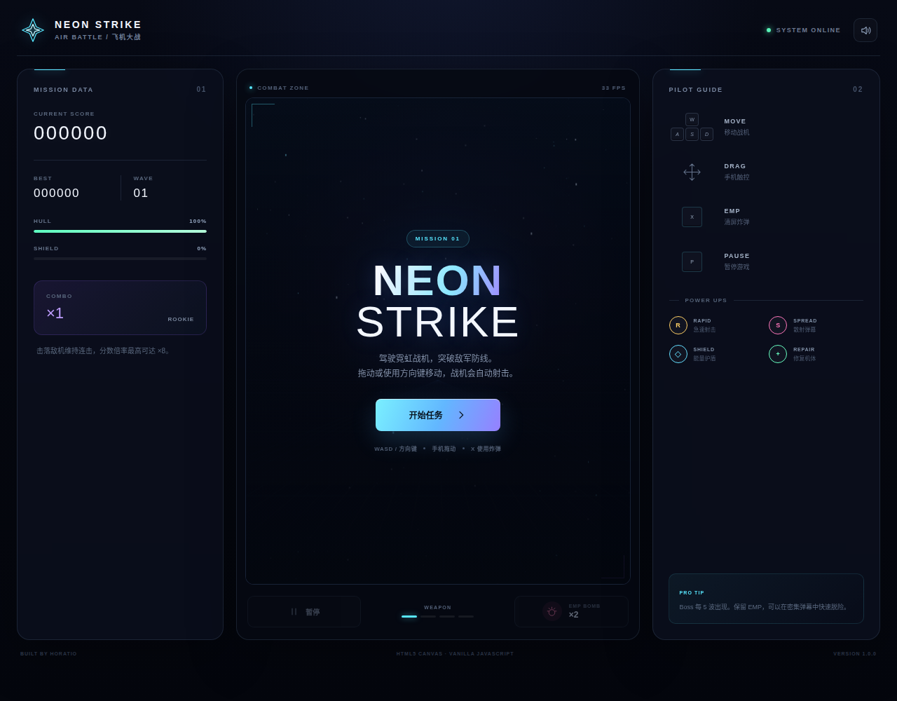
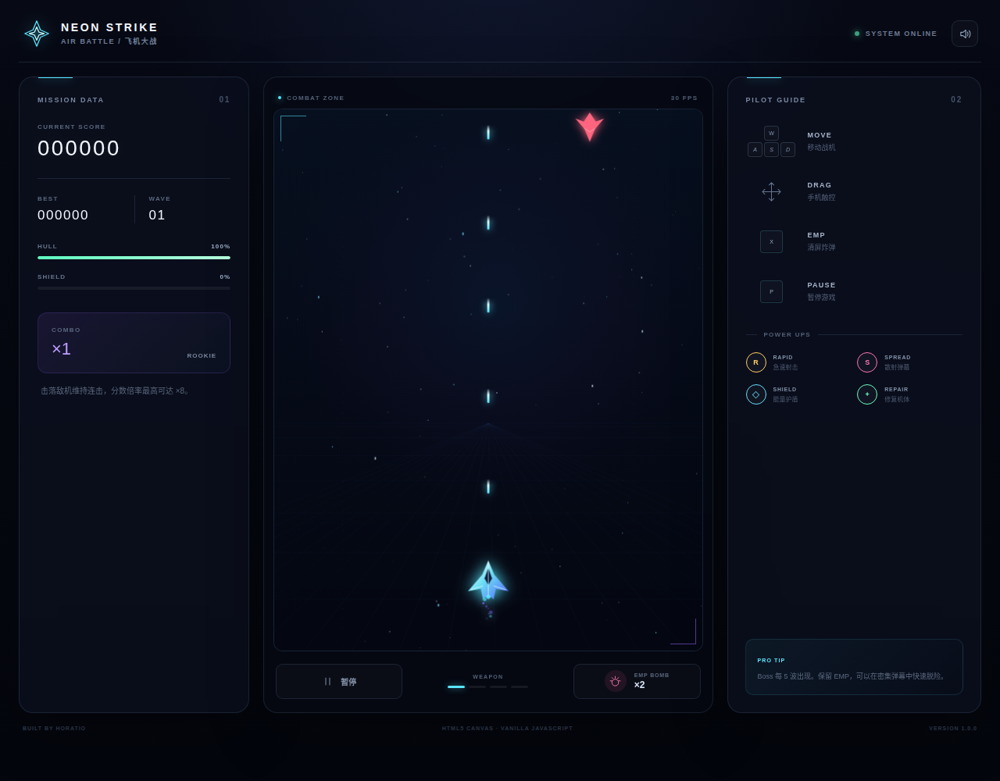

# NEON STRIKE · Air Battle

## Preview / 游戏预览

| Mission menu / 任务界面 | Combat / 战斗画面 |
| :---: | :---: |
|  |  |

## English

**NEON STRIKE** is a responsive airplane shooter built with HTML5 Canvas and vanilla JavaScript. It runs directly in a browser with no framework, build step, account, or external asset required.

### Windows download

Download the latest Windows x64 build from [GitHub Releases](https://github.com/hhhoratioxu/Air_Battle_By_Horatio/releases/latest):

- `NEON-STRIKE-Setup-1.0.0-x64.exe` — installer with desktop and Start Menu shortcuts
- `NEON-STRIKE-Portable-1.0.0-x64.exe` — portable edition, no installation required

The Windows build is not code-signed. Microsoft Defender SmartScreen may ask for confirmation the first time it runs.

### Features

- Responsive gameplay for desktop and mobile browsers
- Keyboard, mouse, and touch controls
- Automatic shooting with four weapon levels
- Scout, dart, tank, and boss enemies
- Rapid-fire, spread-shot, shield, repair, and EMP power-ups
- Combo multiplier, waves, rankings, and locally saved high score
- Lightweight Web Audio sound effects with a mute option
- Pause-on-background behavior for mobile devices

### Play locally

Download the repository and open `index.html` in a modern browser. No installation is required.

You can also serve the folder locally:

```bash
python -m http.server 8080
```

Then visit `http://localhost:8080`.

### Controls

| Action | Desktop | Mobile |
| --- | --- | --- |
| Move | `WASD` or arrow keys | Drag on the game area |
| Fire | Automatic | Automatic |
| EMP bomb | `X` or EMP button | EMP button |
| Pause | `P`, `Esc`, or Pause button | Pause button |

### Technology

- HTML5 Canvas
- Vanilla JavaScript
- CSS responsive layout
- Web Audio API
- Local Storage API

---

## 中文

**NEON STRIKE** 是一款使用 HTML5 Canvas 与原生 JavaScript 制作的响应式飞机大战小游戏。不依赖框架、不需要构建，也不需要任何外部素材，下载后即可在浏览器中运行。

### Windows 下载

前往 [GitHub Releases](https://github.com/hhhoratioxu/Air_Battle_By_Horatio/releases/latest) 下载最新的 Windows x64 版本：

- `NEON-STRIKE-Setup-1.0.0-x64.exe` — 安装版，可创建桌面和开始菜单快捷方式
- `NEON-STRIKE-Portable-1.0.0-x64.exe` — 免安装便携版，双击即可运行

Windows 版本暂未进行代码签名，首次运行时 Microsoft Defender SmartScreen 可能会要求确认。

### 游戏特色

- 同时适配电脑与手机浏览器
- 支持键盘、鼠标及触控操作
- 自动射击与四级武器系统
- 侦察机、突击机、重型机和 Boss 敌人
- 急速射击、散射弹、护盾、修复及 EMP 道具
- 连击倍率、波次、等级与本地最高分
- 轻量 Web Audio 音效及静音开关
- 手机切换到后台时自动暂停

### 本地游玩

下载本仓库后，使用现代浏览器打开 `index.html` 即可，无需安装。

也可以在项目目录运行：

```bash
python -m http.server 8080
```

然后访问 `http://localhost:8080`。

### 操作方式

| 操作 | 电脑 | 手机 |
| --- | --- | --- |
| 移动 | `WASD` 或方向键 | 在游戏区域拖动 |
| 射击 | 自动 | 自动 |
| EMP 炸弹 | `X` 或 EMP 按钮 | EMP 按钮 |
| 暂停 | `P`、`Esc` 或暂停按钮 | 暂停按钮 |

## License

Released under the [MIT License](LICENSE).
